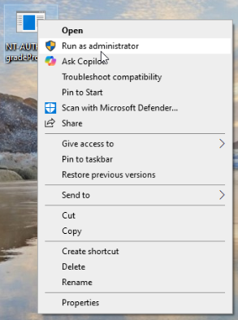
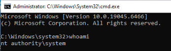
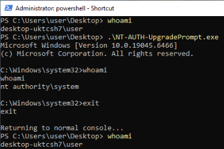

# `winlogon` Impersonation for `NT AUTHORITY\SYSTEM` Command Prompts

Both programs below utilize the `SeImpersonatePrivilege` to obtain SYSTEM privileges from the `winlogon` process using Administrative permissions. They spawn cmd prompt instances in different ways.

<br>

## NT-AUTH-NewPrompt

Windows executable that impersonates the `winlogon` service to open a cmd prompt with `NT AUTHORITY\SYSTEM` permissions. The new command prompt is opened in a new window.

### Usage

1. Right-click `NT-AUTH-NewPrompt.exe` and select **Run as administrator**.

   

2. A new command prompt window will open. Run `whoami` to confirm you are running as `NT AUTHORITY\SYSTEM`.

   

---

## NT-AUTH-UpgradePrompt

Windows executable that impersonates the `winlogon` service to open a cmd prompt with `NT AUTHORITY\SYSTEM` permissions. This program spawns a command prompt with `NT AUTHORITY\SYSTEM` permissions but without a window. It then facilitates communications between the user's command prompt and the program via anonymous pipes to provide the user with an elevated command prompt within the same window.

### Usage

1. Open an **administrative** Command Prompt or PowerShell window.
2. Run the executable from the command line:

   ```
   .\NT-AUTH-UpgradePrompt.exe
   ```

3. Your current window will be upgraded to an `NT AUTHORITY\SYSTEM` session. Run `whoami` to confirm. Type `exit` or hit `cntrl+C` to return to your original prompt.

   
